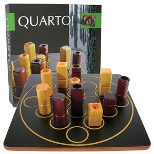

IPSEN1 - Quarto!
=============

This project is related to the IPSEN1 assignment, given by Hogeschool Leiden.

## Assignment ##

The given assignment is to digitize a physical board game. The digital game should cover all the steps and rules as the physical version requires.

## Quarto, the game ##

In short, the quarto game has an 4x4 board with 16 different pawns. The pawns all share properties from each other. A total of 4 properties are available:

- tall or short;
- red or blue (or some other pair of colors, such as light or dark stained wood);
- square or circular;
- hollow or solid.

Players take turns on placing the pawn on the board. Once a turn is done, the current player gives his opponent a new pawn to place on the board. Players can not choose they're own pawns, as there opponents choose these for them.

The goal is to make a row of 4 pawn with at least sharing 1 of the 4 properties. e.g. 4 tall pawns.

Once a shared row is made, the player needs to yell `"QUARTO!"` to win a round.

If the current player does not see the matching row, but the opponent does, he may yell `"QUARTO!"` once his new pawn is retrieved.

If both players do not see the matching row within 1 turn, the row becomes 'invalid' and `"QUARTO"` may not be yelled upon that row.